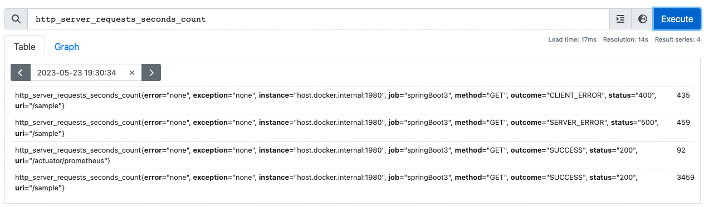
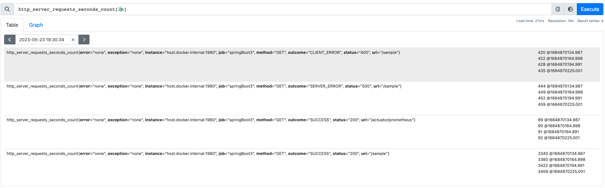

# Observability workshop

## Pre requisits

To follow the workshop, you can prepare you laptop with:

1. Install node. Tipically:
```bash
brew install npm
```

2. Pull the Prometheus and the Grafana containers (yes, you need docker)
```bash
docker pull prom/prometheus
docker pull grafana/grafana
```

3. Checkout the repo:
```bash
git clone https://github.com/oriol-canalias-wefox/observability-workshop
```

And, of course, you will need java + Intellij (or another code editor)

## Introduction

### What is observability

observability is the ability to measure a system's current state based on the data it generates, such as:
- logs
- traces
- metrics

When we talk about "system's current state", we talk not only about the state of our application, but also every hardware, software with which it interacts, cloud infrastructure, etc.

### Monitoring vs observability
Monitoring is capturing and displaying data, whereas observability can discern system health by analyzing its inputs and outputs.

Roughly, monitoring helps us to identify a problem, observability helps understand the root of this problem.

### Metrics
We understand well what is a log, we use in the applications to follow the flow and, when some process fails, understand the input data, the steps that the process did, trying to figure out where is the problem and how to fix it.

More difficult to understand are traces. Traces are the way that we use to observe requests moving across microservices and other systems to find problems that can happen with this relationships.

The metrics are the third part of observability that we are not putting the focus. Basically, a metric is a measure of something. 
Some types are:
- Counter: Value always grows. 
    - Number of requisitions
    - Amount of money
- Guage: Can change randomly
    - Active users
    - Memory usage
- Histogram: It is a type of counter, but grouping in buckets
    - Number of requisitions by time response in buckets of 100ms, 200ms, 300ms, 500ms and more.
- Summary: It is similar to histogram, but instead of defined buckets, the "buckets" are defined by the percentil of the time response
    - Response time 10%, 50%, 70%, 90% and 95%

 
### Some tools
- https://www.dynatrace.com/
- https://www.datadoghq.com/
- https://www.elastic.co/observability
- https://opentelemetry.io/
- https://prometheus.io/
- https://grafana.com/grafana/

## Prometheus

Prometheus is an open source application used to monitoring applications and collecting metrics

### Run locally

We will use docker. So, from root folder:
```bash
docker run --name local-prometheus -p 9090:9090 -v $(pwd)/config/prometheus:/etc/prometheus  -d prom/prometheus 
```

> Advice: After create the container, you will need to use `docker stop local-prometheus` and `docker start local-prometheus`. If you need to recreate the container, you can remove before using `docker rm local-prometheus`.

Run the sample app to generate data. Go to the `app` folder and run from terminal:

```bash
npm install
node ./index.js
```

### PromQL

It is the language to "ask" to Prometheus. 

Data types:
- Scalar: single number
- Instant vector: Values of time serie in a specific instant time. Pex:

- Range vector: Values of time serie in a time range


## Grafana

### Run locally

We will use docker, again.
```bash
docker run --name local-grafana --link local-prometheus:local-prometheus -p 3000:3000 -d grafana/grafana
```

> Advice: After create the container, you will need to use `docker stop local-grafana` and `docker start local-grafana`. If you need to recreate the container, you can remove before using `docker rm local-grafana`.